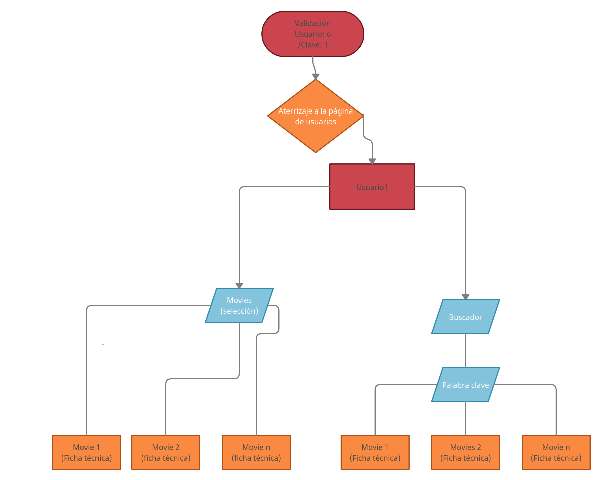
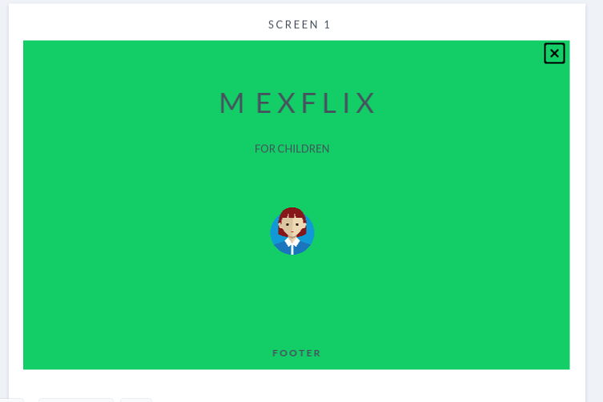
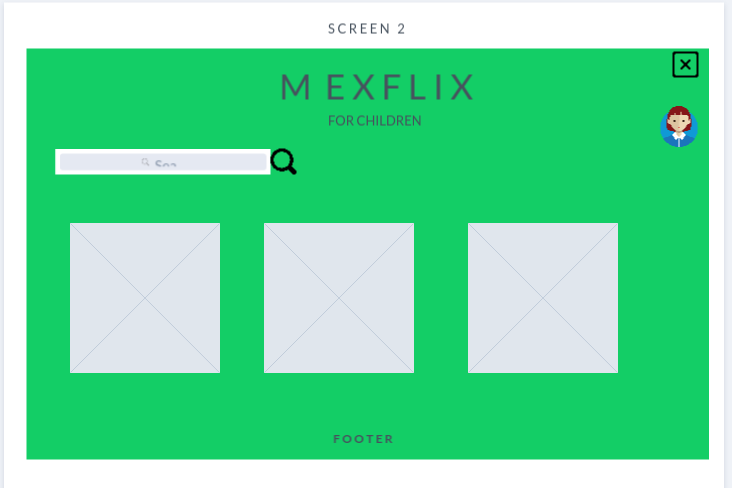

# MEXFLIX FOR CHILDREN

Movie cathalogue to find the best children movie

---

---

## **Índice**

1. Historia de usuario
2. Descripción
3. Necesidades del cliente
4. Criterio de aceptación
5. Conocimientos APP
6. Diagrama de Flujo
7. Diseño de interfaz
8. Producto final
9. Agile

---

## **1. Historia de usuario**

Olivia, una niña de cuatro años de edad pasaba las tardes sin saber qué hacer y demandando atención a sus ocupados padres. Ellos, para darle una distracción, le ofrecieron a Olivia ver alguna película. Ella aceptó emocionada. Sin embargo, pronto todos se dieron cuenta de que en Internet fluye mucha información y de que las búsquedas son riesgosas para una menor de cuatro años.

Olivia quería un sitio donde poder acceder a sus películas favoritas de manera rápida con una previa selección. Los padres, además, necesitaban que la app incluyera un motor de búsqueda seguro para su hija. No había más: ¡necesitaban MEXFLIX FOR CHILDREN!

---

## **2. Descripción**

Aplicación para un catálogo de películas dirigido a un público infantil que busca material específico según su edad y con un buscador que arroja un catálogo relacionado con la palabra clave insertada.

---

## **3. Necesidades del cliente**

1. El usuario quiere leer una selección adecuada de películas recomendadas y adecuadas según sus intereses.

2. El usuario quiere ver un buen catálogo de películas ya preseleccionadas.

3. El usuario quiere poder buscar para encontrar más películas por título, género y actores.

---

## **4. Criterios de aceptación**

Esta aplicación deben permitir al usuario buscar y encontrar un catálogo de películas que muestre al menos:

1. póster
2. título
3. año
4. actores
5. género

Se entrega el producto con una URL (deployado).

---

## **5. Conocimientos APP**

- npm init
- API
- Método fetch()
- Promesas en JavaScript
- JSON
- Iterar datos
- Módulos de importación y exportación
- Respuestas HTTP
- Prueba unitaria (testing)
- Modelado de ramas GitHub (branch: development)

## **6. Diagrama de flujo**

---

## **7. Diseño de Interfaz**

---

## **8. Producto final**

Pantalla 1: usuario: o / contraseña: 1

## 

Pantalla 2: Portal de usuarios

## 

Pantalla 3: Usuario 1: child

## 

Catálogo Usuario 1

## 

Películas

## 

Fichas técnicas

## 

---

## **9. Agile**

Kamban incial: Distribución de tareas.

## 

Kamban final: tareas hechas.

## 
